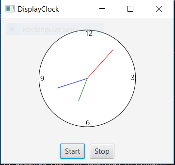

# Week05 Assign: Exercise 15.32 Control Clock

Add two buttons to start and stop the clock

## Example Output

This image will display as your example output. Name the image README.jpg in your project folder.

## Analysis Steps

Write a program that lets the user control the clock with the start and stop buttons. I looked in the book on how to create the buttons and add events to control the animation.

### Design

How did you approach your program design? Did you use multiple classes to define various objects?

I created the buttons then added them to an HBox then added the HBox and the clock into a border pane, then I had the borderpane display in the scene. I created the buttons with the on click events and the lambdas we learned in class.

### Testing

A step by step series of examples that you developed to properly test the program. 

Say what the step will be

Run the program click stop, the clock should stop moving.
Click the start button it should start moving again.

And repeat

End with an example of getting some data out of the system or using it for a little demo

## Notes

The hardest part for me was figuring out how to get the buttons to show up, I had to look up on google for a bit to find out I could add them into an HBox then put the HBox into a borderpane with the clock and then display it all in one scene.

## Do not change content below this line
## Adapted from a README Built With

* [Dropwizard](http://www.dropwizard.io/1.0.2/docs/) - The web framework used
* [Maven](https://maven.apache.org/) - Dependency Management
* [ROME](https://rometools.github.io/rome/) - Used to generate RSS Feeds

## Contributing

Please read [CONTRIBUTING.md](https://gist.github.com/PurpleBooth/b24679402957c63ec426) for details on our code of conduct, and the process for submitting pull requests to us.

## Versioning

We use [SemVer](http://semver.org/) for versioning. For the versions available, see the [tags on this repository](https://github.com/your/project/tags). 

## Authors

* **Billie Thompson** - *Initial work* - [PurpleBooth](https://github.com/PurpleBooth)

See also the list of [contributors](https://github.com/your/project/contributors) who participated in this project.

## License

This project is licensed under the MIT License - see the [LICENSE.md](LICENSE.md) file for details

## Acknowledgments

* Hat tip to anyone who's code was used
* Inspiration
* etc
