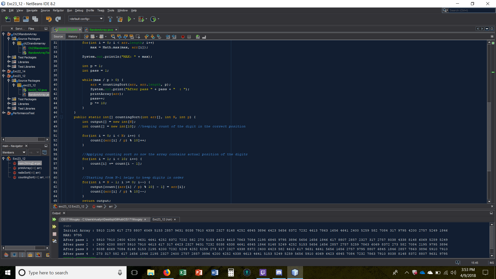

# Exc 23.12

Create a program that uses a radix sort.

## Example Output

This image will display as your example output. Name the image README.jpg in your project folder.

## Analysis Steps

Write a program that rnadomly generates 1,000,000 integers and sorts them using a radix sort.

### Design

I created the array with random numbers and had it print.
I then made sure to get the biggest number called max to test by dividing by increments of 10 until it was less than 0 to make sure im
  cycling into countingSort the correct amount of times.
Then in countingSort I would get the correct digit starting from the ones place and move them into the correct place in the array output
  which would be returned back to the origin array arr.

### Testing

I would place printlines after each loops to make sure I was getting the correct sorting position I wanted.

## Notes

Explain any issues or testing instructions.

## Do not change content below this line
## Adapted from a README Built With

* [Dropwizard](http://www.dropwizard.io/1.0.2/docs/) - The web framework used
* [Maven](https://maven.apache.org/) - Dependency Management
* [ROME](https://rometools.github.io/rome/) - Used to generate RSS Feeds

## Contributing

Please read [CONTRIBUTING.md](https://gist.github.com/PurpleBooth/b24679402957c63ec426) for details on our code of conduct, and the process for submitting pull requests to us.

## Versioning

We use [SemVer](http://semver.org/) for versioning. For the versions available, see the [tags on this repository](https://github.com/your/project/tags). 

## Authors

* **Billie Thompson** - *Initial work* - [PurpleBooth](https://github.com/PurpleBooth)

See also the list of [contributors](https://github.com/your/project/contributors) who participated in this project.

## License

This project is licensed under the MIT License - see the [LICENSE.md](LICENSE.md) file for details

## Acknowledgments

* Hat tip to anyone who's code was used
* Inspiration
* etc
