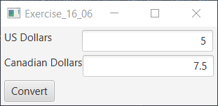

# Unit 2 Hands On

The program let the user enter an amount in US dollars and display its equivalent value in Canadian dollars when clicking the Convert button.

## Example Output

This image will display as your example output. Name the image README.jpg in your project folder.



## Analysis Steps

I started by creating the TextFields then made the button after that I created the panes to hold the TextFields and disabled the Canadian Dollars one so it was uneditable, then I created the event handler for the button with the math to convert the USD to Canadian Dollars and create the output to be placed in the Canadian Dollars TextField

### Design

How did you approach your program design? Did you use multiple classes to define various objects?

I used multiple TextFields for the USD and Canadian Dollars, a button, and an event handler to convert the USD to Canadian Dollars when clicked

### Testing

A step by step series of examples that you developed to properly test the program. 

Say what the step will be

```
Give the example
```

And repeat

```
until finished
```

End with an example of getting some data out of the system or using it for a little demo

## Notes

Explain any issues or testing instructions.

## Do not change content below this line
## Adapted from a README Built With

* [Dropwizard](http://www.dropwizard.io/1.0.2/docs/) - The web framework used
* [Maven](https://maven.apache.org/) - Dependency Management
* [ROME](https://rometools.github.io/rome/) - Used to generate RSS Feeds

## Contributing

Please read [CONTRIBUTING.md](https://gist.github.com/PurpleBooth/b24679402957c63ec426) for details on our code of conduct, and the process for submitting pull requests to us.

## Versioning

We use [SemVer](http://semver.org/) for versioning. For the versions available, see the [tags on this repository](https://github.com/your/project/tags). 

## Authors

* **Billie Thompson** - *Initial work* - [PurpleBooth](https://github.com/PurpleBooth)

See also the list of [contributors](https://github.com/your/project/contributors) who participated in this project.

## License

This project is licensed under the MIT License - see the [LICENSE.md](LICENSE.md) file for details

## Acknowledgments

* Hat tip to anyone who's code was used
* Inspiration
* etc
