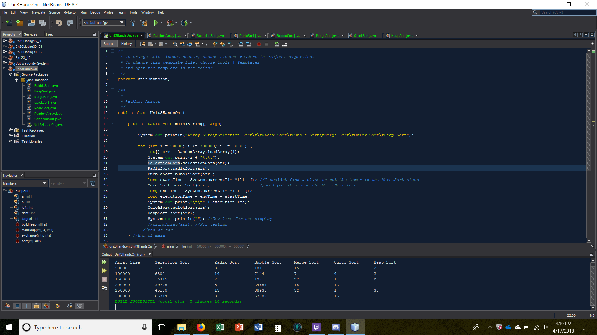

# Unit 3 Hands On

Write a program that obtains the execution time of selection sort, radix sort, bubble sort, merge sort, quick sort, and heap sort for input size 50000, 100,000, 150,000, 200,000, 250,000, and 300,000.

## Example Output

This image will display as your example output. Name the image README.jpg in your project folder.

## Analysis Steps

This section should restate the assignment and explain how you analyzed the requirements in order 
to develop a solution.

### Design

I created classes for each sorting method and to create the array to be sorted, and in the main I created a loop that would increment the size of the array. The array was sent to each sorting class that would be timed then the display would show the size of the array and the time required to complete.

### Testing

I started by creating the class to create the array and then the first sorting method which was the selection sort, I ran the program with a small array to see if it worked and sorted it correctly and if it did then I moved on to the next sorting method repeating the steps above.

## Notes

I ran into an issue with the quick sort, it was giving me an error saying "stackoverflow error" I tested it a lot and saw that it only had an error when sorting an array above the size of 8000, I ended up finding out that it was because the quick sort I was using was using to many recursions and would throw that error and I needed to change how it sorted a bit.

## Do not change content below this line
## Adapted from a README Built With

* [Dropwizard](http://www.dropwizard.io/1.0.2/docs/) - The web framework used
* [Maven](https://maven.apache.org/) - Dependency Management
* [ROME](https://rometools.github.io/rome/) - Used to generate RSS Feeds

## Contributing

Please read [CONTRIBUTING.md](https://gist.github.com/PurpleBooth/b24679402957c63ec426) for details on our code of conduct, and the process for submitting pull requests to us.

## Versioning

We use [SemVer](http://semver.org/) for versioning. For the versions available, see the [tags on this repository](https://github.com/your/project/tags). 

## Authors

* **Billie Thompson** - *Initial work* - [PurpleBooth](https://github.com/PurpleBooth)

See also the list of [contributors](https://github.com/your/project/contributors) who participated in this project.

## License

This project is licensed under the MIT License - see the [LICENSE.md](LICENSE.md) file for details

## Acknowledgments

* Hat tip to anyone who's code was used
* Inspiration
* etc
